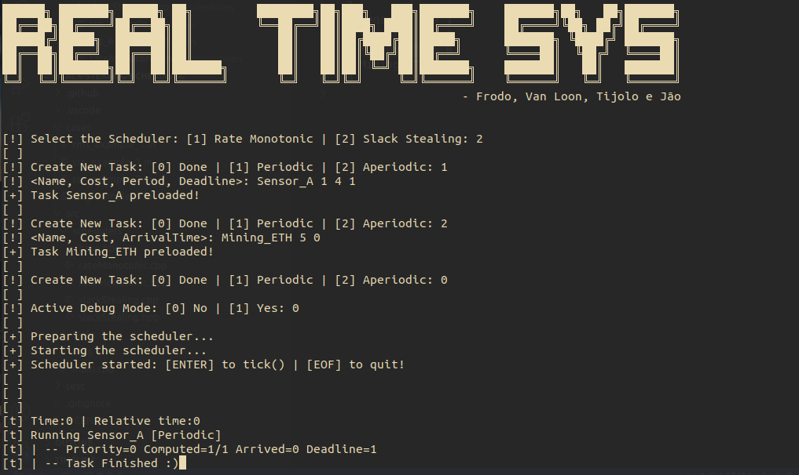

# Slack-Stealing-Scheduling
A Slack Stealing Scheduling study and demo for the Real Time class(SSC0745) at ICMC.

The presentation for the class can be found [here](https://docs.google.com/presentation/d/1wUHSZHN1s09kF3d04FIuiGNDWOS_rlAhPgAAa7K_vKc/edit?usp=sharing) or in PDF [here](./PRESENTATION.pdf).

## How to Execute

- `make` to compile the program with g++ with C++17.
- `make check` to execute the tests created.
- `make run` to execute the program.
- `make case filename=<filename.in>` to execute loading the tasks from a case file from `/cases`.
- `make clear` to remove the `.out` files.
